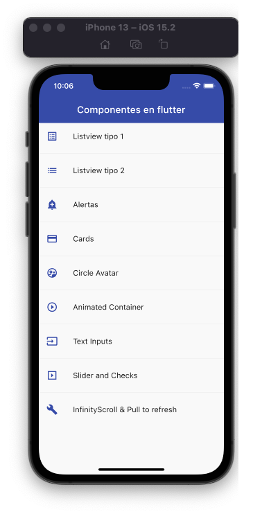
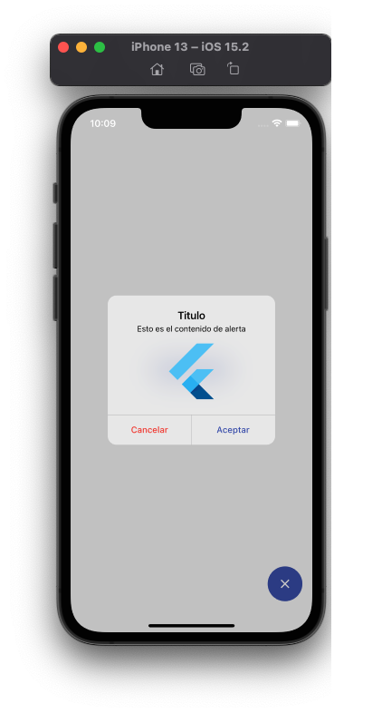
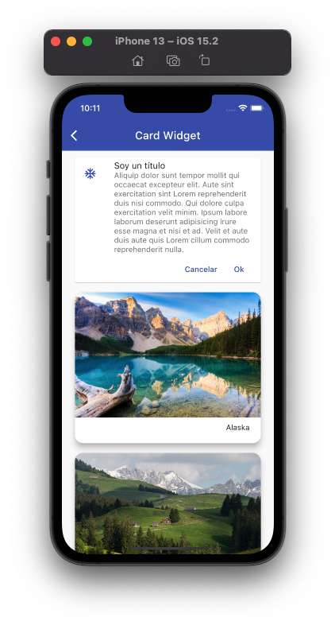
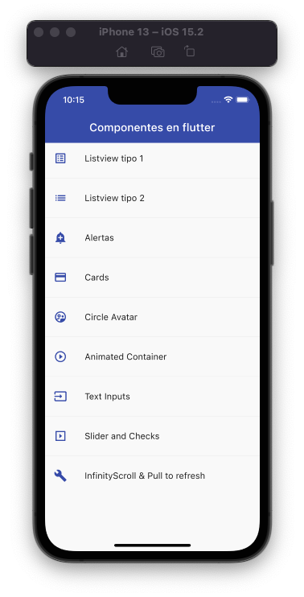

# Aplicación con ejemplos de Widgets

Esta aplicación muestra una lista de widgets más utilizados en flutter

## Menú app

Utilizamos un app-routes.dart para centralizar el menú y un tema personalizado fácil de cambiar toda la app.

### Menu

## Pantallas

y muchas más...